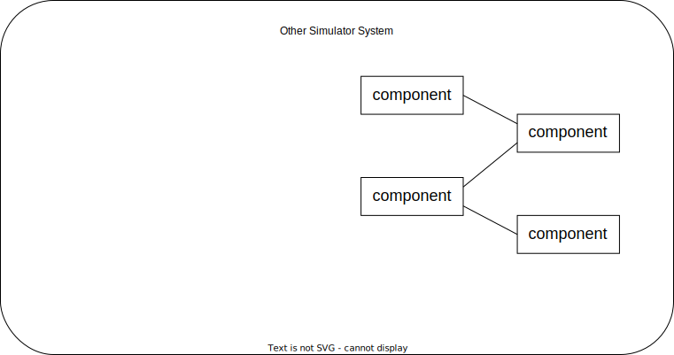
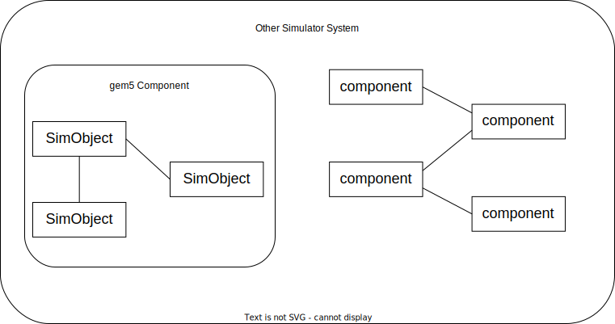
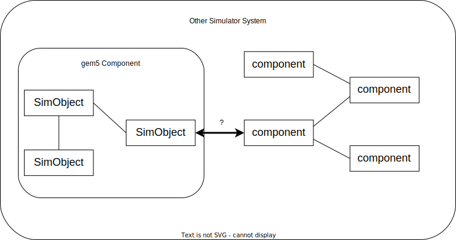

<!-- _class: title -->

## gem5/SST Integration

---

## (Optional) gem5 as a Library: Hello, World!

*  Compiling gem5 as a library
```bash
scons build/RISCV/libgem5_opt.so -j17 --without-tcmalloc
```
* Compiling gem5 component,
```bash
cd ext/sst
docker run --rm --volume
/var/lib/docker/codespacemount/workspace/:/workspaces -w `pwd` -it ---entrypoint /bin/bash/ grc.io/gem5-test/sst-env
make -j4
```
*  Running the simulation,
```bash
sst --add-lib-path=./sst/example.py
```

---

## gem5 as a Library: instatiation



---

## gem5 as a Library: instatiation



---

## gem5 as a Library: instatiation



---

## gem5 as a Library: instatiation


---


## gem5 as a Library

How to set up gem5 in another simulator?

* Step 1: Setting up the gem5 Python environment.
    * Need to manually import the m5 module
* Step 2: Reading the gem5 Python system configuration file.
    * This includes setting up the communication data path for gem5 and the other simulator


* Notes:
    * m5.instatiate() must be called before any simulation.
    * m5.simluate(K) runs the gem5 simulation for K ticks.

---

## gem5 as a Library: simulation


---

## gem5 as a Library: simulation

For every external simulator clock tick:

```python
external_simulator.advance_to_next_event()
gem5_system.advance(n_ticks)
```

where ```n_ticks =``` time difference between this event and previous event of the external simulator

---

## Case study: gem5/SST integration

SST: Structural Simulation Toolkit
http://sst-simulator.org/

* A highly parallelized discrete event simulator.
* Consists of:
    * SST-Core (the simulator)
    * SST-Elements (components)
    * SST-Macro

---

## SST: Brief Overview

* Simulation objects:
    * SST::Component (similar to gem5::SimObject)
    * SST::Link (allows two components to send SST::Event to each other)
        * Bidirectional
    * SST::Event (similar to gem5::Event)
        * Sent via SST::Link

* Parallelization,
    * SST partitions components to multiple partitions.
    * Communication between partitions are done via MPI.
    * The partitioning process can be done automatically or manually

---

## gem5/SST Integration


---

## gem5/SST Integration


---

## gem5/SST Integration

* gem5 provides:
    * OutgoingRequestBridge: a Request port sending requests to external components.
    * SSTResponderInterface: an interface for a Response port for an external component.
* gem5 Component is an SST::Component, which has multiple SSTResponder's implementing the SSTReponderInterface.
* The packet translation happens within the gem5 Component.

---

## gem5/SST Integration


---

## gem5/SST Integration

* Example (arm and RISC-V):
    * gem5 as an SST component: gem5/ext/sst/
    * SST system configuration: gem5/ext/sst/sst/example.py
    * gem5 system configuration: gem5/configs/example/sst/riscv_fs.py
* System setup:
    * SST drives the simulation.
    * One gem5 component, which consists of 4 detailed cores.
    * Cache and memory are SST::Components from SST-Elements.

---

## gem5/SST Integration

* System setup:
    * SST drives the full-system simulation.
    * One gem5 component, which consists of 4 detailed cores.
    * Cache and memory are SST::Components from SST-Elements.
* Limitations:
    * gem5 cores wake up frequently per CPU clock tick.
    * The cores are frequently synchronized due to cache coherency protocol.
    * Needs work for block devices to work.

---

## gem5/SST Integration

* However, we can set up multiple-node simulation.
* How?
    * Having multiple gem5 components, each represents a node.
    * Each gem5 component is in a different partition.
    * Communication between gem5 instances can be done via gem5 PIO devices.
* Why?
    * There are more parallelism at the node granularity.

---

## Other Notes

* SST has its own Python environment, so gem5 within SST should not initialize the Python environment again.
* However, the m5 and gem5 libraries should be manually imported.
* m5 library has a function to find SimObject given a SimObject name.
    * Useful for finding the owner for a port in an external simulator.

---

## Documentation

* Setup
    * gem5/ext/sst/README.md
* gem5 interfaces for communication with an external simulator,
    * gem5/src/sst
* gem5 as a component in an external library,
    * gem5/ext/sst
* Compiling the bootloader + kernel + custom workload in a binary,
    * https://gem5.googlesource.com/public/gem5-resources/+/refs/heads/stable/src/riscv-boot-exit-nodisk/README.md
